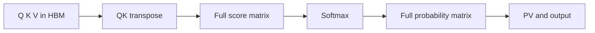

> [!important] 一句话先记住
> FlashAttention 是一种 **精确的、IO-aware 的 Attention 算法与高性能 kernel 实现**：通过 tiling、online softmax、kernel fusion 和 backward recomputation，避免把完整的注意力矩阵反复写入 GPU HBM。
> 它主要减少内存层级之间的数据搬运和峰值显存，不是把 Attention 的计算复杂度从二次降成线性。

> [!abstract] 适合解决什么问题
> 当序列较长、Attention 占据明显运行时间，或普通实现因物化 score/probability 矩阵而受显存和带宽限制时，FlashAttention 通常值得考虑。
> 训练和 Prefill 往往更容易获得收益；Decode 只有少量 query token 时，瓶颈和最佳 kernel 可能不同，必须按真实 shape benchmark。

## 1. Attention 为什么会慢

对单个 attention head，设序列长度为 `N`、head dimension 为 `d`：

$$
S = \frac{QK^\top}{\sqrt{d_k}}, \quad
P = \operatorname{softmax}(S), \quad
O = PV
$$

其中：

- `Q`、`K`、`V` 的形状通常是 `N × d`；
- score 矩阵 `S` 和概率矩阵 `P` 的形状是 `N × N`；
- 计算量仍然是 `O(N²d)`，而 `S`/`P` 的存储规模是 `O(N²)`。

朴素实现通常按多个 kernel 完成 `QKᵀ`、softmax 和 `PV`：



问题不只是 FLOPs：

1. `N × N` 的中间矩阵需要写入 HBM，再由下一个 kernel 读回；
2. softmax 还需要 row-wise max、sum 和数值稳定处理；
3. 多次读写大矩阵会消耗显存带宽，GPU 计算单元可能在等待数据；
4. 训练反向还要保存或重建大量中间状态。

FlashAttention 的出发点是把 GPU 内存层级也纳入算法设计：让 HBM 保存输入和最终输出，把可复用的 tile 尽量留在片上 SRAM、shared memory 或 registers 中。

## 2. FlashAttention 的核心机制

### 2.1. Tiling：分块计算而不是物化完整矩阵

把 `Q`、`K`、`V` 沿序列维度切成 block：

```text
Q = [Q_0, Q_1, ...]
K = [K_0, K_1, ...]
V = [V_0, V_1, ...]

对一个 Q block 和一个 K/V block：
1. 从 HBM 加载 tile 到片上高速存储；
2. 计算局部 score tile；
3. 在片上完成 mask、缩放和 softmax 更新；
4. 立刻把概率 tile 与 V tile 累积到输出；
5. 丢弃局部 score/probability tile，再处理下一个 block。
```

因此，完整的 `N × N` 矩阵从未作为持久化中间结果出现。注意：tile 仍然会在片上短暂存在，FlashAttention 消除的是对完整矩阵的 HBM 物化，而不是所有中间数值。

### 2.2. Online softmax：跨 block 维护稳定统计量

普通 softmax 需要看到一整行 score 才能得到最大值和归一化分母。分块之后，FlashAttention 为每个输出行维护：

- `m`：目前见过的 score 最大值；
- `l`：经过稳定化处理的指数和；
- `o`：未完成归一化的输出累加器。

当新的 score block 到达时，设其行最大值为 `m_block`、稳定化指数和为 `l_block`，则可以用重标定的方式合并：

$$
m_{\mathrm{new}} = \max\left(m_{\mathrm{old}},\, m_{\mathrm{block}}\right)
$$

$$
l_{\mathrm{new}}
=
e^{m_{\mathrm{old}}-m_{\mathrm{new}}} l_{\mathrm{old}}
+
e^{m_{\mathrm{block}}-m_{\mathrm{new}}} l_{\mathrm{block}}
$$

输出累加器也使用同样的缩放因子更新。这样无需保存整行 `S` 或 `P`，仍能得到与标准 Attention 数学等价的结果。

> [!note] exact 的含义
> “Exact” 指算法没有引入稀疏、低秩或近似 Attention 的模型级近似；实际数值仍会受到 dtype、累加精度、归约顺序和硬件指令的浮点误差影响，不能理解为逐 bit 完全一致。

### 2.3. Kernel fusion：把依赖步骤放进同一个 kernel

FlashAttention 通常把以下步骤放在一个融合 kernel 的内部循环中：

- 载入 Q/K/V tile；
- 矩阵乘和 scale；
- causal 或其他 mask；
- row-wise max、exp、sum；
- online softmax 的重标定；
- 与 V 的矩阵乘和输出累积；
- 写回最终 O 和必要的统计量。

融合的价值是减少 kernel launch、HBM round trip 和中间 tensor；代价是 kernel 设计、寄存器分配、shared memory 使用和调试都更复杂。

### 2.4. Backward recomputation：用计算换显存

训练反向需要 `dQ`、`dK`、`dV`。如果保存完整的 `S`/`P`，显存开销很大；FlashAttention 通常保存输出和 log-sum-exp 等必要统计量，在 backward 中重新加载 Q/K/V 并重算局部 score/probability tile。

这是一种明确的 trade-off：

| 选择 | 优点 | 代价 |
| --- | --- | --- |
| 保存完整中间矩阵 | 反向少一些重算 | 峰值显存和 HBM 流量高 |
| 保存紧凑统计量并重算 | 显存更低、适合长序列 | backward 增加计算 |

FlashAttention 的关键不是让 FLOPs 消失，而是让增加的计算换来更少的昂贵 HBM 访问。

## 3. 复杂度与内存模型

| 维度 | 朴素 Attention | FlashAttention |
| --- | --- | --- |
| 数学结果 | 标准 Attention | 精确 Attention，误差来自浮点实现 |
| 密集计算量 | `O(N²d)` | `O(N²d)`，通常有少量重算 |
| 完整 score/probability 是否落 HBM | 通常会 | 不会持久化完整矩阵 |
| 训练保存的主要中间量 | 可能包含 `N × N` 矩阵 | 输出、LSE 等紧凑统计量 |
| 峰值辅助显存 | 随 `N²` 增长明显 | 近似随 `N` 增长，受 tile 和实现影响 |
| 性能主要瓶颈 | 计算与大量 HBM 读写 | tile 复用、片上容量、并行划分和硬件利用率 |

原始论文在两级内存模型下分析了 HBM 访问：标准实现的访问量包含 `Θ(Nd + N²)` 项，而 FlashAttention 在适用的 SRAM 区间内可降为与 tile 和 SRAM 容量相关的 `Θ(N²d²M⁻¹)` 形式。这里的重点是 IO 复杂度下降，并不意味着密集 Attention 的 FLOPs 变成线性。

## 4. 一次 forward 的概念流程

下面是便于建立直觉的伪代码，实际实现会根据 causal、变长序列、head dimension、硬件和 kernel 版本调整循环顺序与并行映射：

```text
for each Q block Q_i:
    load Q_i
    initialize m_i, l_i, O_i

    for each K/V block (K_j, V_j):
        load K_j and V_j
        S_ij = Q_i @ K_j^T * scale
        apply causal or local mask
        update row max and online softmax statistics
        O_i = O_i + normalized(P_ij) @ V_j

    normalize O_i
    store O_i and required LSE statistics
```

实现层面常见的关注点：

- **访存合并**：Q/K/V 的 layout 是否让连续线程访问连续地址；
- **tile 形状**：`BLOCK_M`、`BLOCK_N` 和 head dimension 如何适配 SRAM、register 与 Tensor Core；
- **并行粒度**：一个 thread block 或 warp group 负责什么范围；
- **mask 代价**：causal、window、padding 和 varlen 会带来多少无效计算；
- **归约与精度**：max、sum、exp 和累加器采用什么精度。

## 5. 版本演进：FlashAttention-1 到 FlashAttention-4

| 版本 | 主要贡献 | 硬件或实现重点 |
| --- | --- | --- |
| FlashAttention-1 | IO-aware exact attention；tiling、online softmax、重计算 | 以减少 HBM 访问和峰值显存为核心 |
| FlashAttention-2 | 减少非矩阵乘 FLOPs；改进跨 sequence/head 的并行化；优化 warp 间 work partitioning | 提高 occupancy 和矩阵乘吞吐 |
| FlashAttention-3 | 利用 Hopper 的异步能力，把数据搬运、GEMM 和 softmax 更好地重叠；支持 FP8 路径 | TMA、warp specialization、WGMMA；官方仓库曾以 beta 形式发布 |
| FlashAttention-4 | 官方仓库当前提供的 CuTeDSL 路线，面向 Hopper 和 Blackwell | 与 FA2/FA3 的 API、安装方式和硬件覆盖不能直接假设相同 |

版本选择不要只看编号：要同时看 GPU 架构、CUDA 或 ROCm 版本、PyTorch 版本、head dimension、dtype、causal/varlen/GQA 支持和实际 workload。

原始论文和官方仓库给出的定位：

- [FlashAttention-1 论文](https://arxiv.org/abs/2205.14135)：提出 IO-aware exact attention；
- [FlashAttention-2 论文](https://arxiv.org/abs/2307.08691)：重点改进 parallelism 和 work partitioning；
- [FlashAttention-3 论文](https://arxiv.org/abs/2407.08608)：面向 Hopper 的异步与低精度优化；
- [官方仓库 README](https://github.com/Dao-AILab/flash-attention)：查看当前 FA2、FA3 和 FA4 的安装、硬件与接口状态。

## 6. Prefill、Decode 与不同 Attention 形态

### 6.1. Prefill 和训练

训练和 Prefill 通常具有较长的 query 序列，Q/K/V 的块化矩阵计算规模较大，FlashAttention 更容易把 Tensor Core、片上复用和 HBM 带宽优势发挥出来。

但端到端收益还取决于：

- QKV projection、通信、激活函数和其他层是否成为新的瓶颈；
- batch size、序列长度和 head dimension 是否落在 kernel 的高效区间；
- dropout、causal mask、变长序列和 GQA 是否改变了 kernel 路径。

### 6.2. Decode

自回归 Decode 常常每次只生成一个或少量 query token，却要读取较长的 KV Cache。此时瓶颈可能更偏向 KV 读带宽、cache layout、请求并发和 split-K/并行归约，而不只是标准 dense Attention 的矩阵乘。

所以“FlashAttention 对 Prefill 很快”不能直接推出“它对所有 Decode 都最快”。在 LLM serving 中，应该让 runtime 根据 query 长度、KV Cache 组织方式、batch 和 GPU 选择合适的 attention backend。

这也是为什么 FlashAttention 与 PagedAttention 的关注点不同：前者主要优化 Attention tile 的计算与 IO，后者主要解决 paged KV Cache 的存储和访问组织；在具体系统中可以组合，但不是同一个算法。

### 6.3. Causal、varlen、MQA/GQA 与局部窗口

实际 kernel 往往还要处理：

- causal mask：只计算可见的上三角或下三角区域；
- varlen：不同样本长度不同，通常需要 cumulative sequence lengths；
- MQA/GQA：Q head 数与 KV head 数不同，需要正确广播或复用 K/V；
- sliding window 或局部 Attention：只访问窗口内的 K/V；
- dropout 和 deterministic backward：训练时会影响状态保存、重算和性能。

这些功能是否可用、限制是什么，取决于具体库版本和 backend，不能只根据“支持 FlashAttention”这一句话判断。

## 7. 与 Triton、PyTorch 和 vLLM 的关系

| 对象 | 它是什么 | 与 FlashAttention 的关系 |
| --- | --- | --- |
| FlashAttention | Attention 算法与高性能 kernel 实现家族 | 直接定义 tiling、online softmax、重算和硬件映射 |
| OpenAI Triton | GPU kernel 的 Python DSL 与编译框架 | 可以作为实现某些 FlashAttention 风格 kernel 的编程/编译工具；Triton 本身不是 FlashAttention 算法 |
| PyTorch SDPA | 统一的 scaled dot-product attention API | 运行时可能 dispatch 到 FlashAttention 风格的 fused kernel，但 API 名称不等于 Dao-AILab 实现 |
| vLLM | LLM 推理 runtime | 负责请求调度、KV Cache 和 attention backend 选择；FlashAttention 是其中可能使用的 kernel/算法路线 |

因此要区分三个层次：

1. **算法**：如何用 tiling 和 online softmax 计算 exact attention；
2. **kernel 实现**：CUDA、Triton、CuTeDSL 或其他后端如何把算法映射到硬件；
3. **runtime**：PyTorch、vLLM 等如何组织 tensor、KV Cache、请求和 backend。

## 8. 实际使用与接口注意事项

官方 `flash-attention` 仓库当前的基础安装通常需要 CUDA 或 ROCm toolkit、PyTorch、`packaging`、`psutil` 和 `ninja`；官方文档以 Linux 为主要支持环境，Windows 编译支持仍应按目标版本单独验证。

一个典型的 FA2 风格调用示例：

```python
import torch
from flash_attn import flash_attn_func

batch = 2
seqlen = 2048
nheads = 16
head_dim = 128

q = torch.randn(batch, seqlen, nheads, head_dim, device="cuda", dtype=torch.float16)
k = torch.randn_like(q)
v = torch.randn_like(q)

out = flash_attn_func(q, k, v, causal=True)
```

这个示例的关键不是固定参数，而是注意接口约定：

- `flash_attn_func` 常见输入布局是 `batch × seqlen × nheads × head_dim`；
- PyTorch SDPA 常见布局是 `batch × nheads × seqlen × head_dim`，对比时需要显式 transpose；
- eval/inference 时通常设置 `dropout_p=0.0`；
- `causal=True` 与非 causal 结果不能混用作 benchmark；
- API、支持的 head dimension 和 dtype 会随安装版本变化，应以当前仓库和 `help`/签名为准。

FA3 和 FA4 的调用入口、安装包和硬件要求可能与 FA2 不同。官方 README 当前列出了 FA3 的 Hopper 路线，以及 FA4 的 `flash-attn-4`/CuTeDSL 路线；不要把不同代际的安装命令混在同一个环境里。

## 9. 正确的 benchmark 方法

至少固定以下变量：

| 类别 | 需要固定或记录的变量 |
| --- | --- |
| 硬件 | GPU 型号、显存、驱动、CUDA/ROCm 版本 |
| 软件 | PyTorch、flash-attn、编译器和 runtime 版本 |
| shape | batch、`seqlen_q`、`seqlen_k`、head 数、head dimension |
| 语义 | causal、dropout、varlen、GQA/MQA、window、dtype |
| 测量 | warmup 次数、同步位置、重复次数、统计口径 |

建议按下面顺序：

1. 先用 PyTorch reference 或 SDPA 验证数值正确性；
2. 预热并排除首次编译、autotune 和 CUDA context 初始化；
3. 在 GPU kernel 前后正确调用 `torch.cuda.synchronize()`；
4. 比较 median、p95/p99、峰值显存和有效吞吐，而不是只看一次最小值；
5. 分别测 forward、backward、Prefill 和 Decode，不要用一个指标代表全部场景；
6. 用 profiler 检查 HBM、L2、shared memory、Tensor Core、occupancy、kernel launch 和同步。

正确性检查至少覆盖：

- 短序列、长序列和非整除 tile 的长度；
- causal 与非 causal；
- fp16、bf16 和必要的 FP8 路径；
- 不同 head dimension；
- padding、varlen、MQA/GQA；
- 前向输出、反向梯度和极端值下的数值稳定性。

## 10. 常见误区

1. **“FlashAttention 把 Attention 复杂度降成线性。”**  
   它主要优化 IO 和峰值显存；密集 exact attention 的计算量仍然是二次级别。

2. **“FlashAttention 是近似 Attention。”**  
   FlashAttention-1/2/3 的核心路线是 exact attention；稀疏或线性近似是另一个维度。

3. **“不用存 `N × N` 矩阵，就完全不占额外显存。”**  
   仍需要输出、LSE、tile、workspace、KV Cache 和框架管理的其他 buffer。

4. **“所有场景都应该用同一个 FlashAttention 版本。”**  
   GPU 架构、dtype、head dimension、Prefill/Decode、varlen 和 GQA 都可能改变最佳实现。

5. **“PyTorch SDPA 等于 Dao-AILab FlashAttention。”**  
   SDPA 是 API 和 dispatch 层；它可能选择某种 FlashAttention 风格 kernel，但具体实现由版本、设备和输入决定。

6. **“kernel benchmark 快，端到端就一定快。”**  
   projection、通信、KV Cache、调度、同步和数据布局转换都可能吞掉 kernel 的局部收益。

## 11. 学习路径

1. 先复习 Attention 的 Q、K、V、scale、softmax、causal mask 和反向传播。
2. 阅读 [FlashAttention-1 论文](https://arxiv.org/abs/2205.14135)，重点理解 IO-aware、tiling 和 online softmax。
3. 阅读 [FlashAttention-2 论文](https://arxiv.org/abs/2307.08691)，重点理解跨 sequence/head 并行和 warp work partitioning。
4. 结合 OpenAI Triton 笔记，理解算法如何落到 tile、program、warp、shared memory 和 Tensor Core。
5. 用 PyTorch SDPA 和 `flash_attn_func` 做同 shape 的正确性与性能对比。
6. 再进入 vLLM attention backend、PagedAttention 和 Decode 专用优化，做端到端而非只看 kernel 的评估。

## 12. 参考资料

### 12.1. 官方实现与文档

- [Dao-AILab/flash-attention 官方仓库](https://github.com/Dao-AILab/flash-attention)
- [官方使用说明与集成列表](https://github.com/Dao-AILab/flash-attention/blob/main/usage.md)
- [FlashAttention-4 CuTeDSL README](https://github.com/Dao-AILab/flash-attention/tree/main/flash_attn/cute)
- [PyTorch scaled dot product attention 文档](https://docs.pytorch.org/docs/stable/generated/torch.nn.functional.scaled_dot_product_attention.html)

### 12.2. 论文

- [FlashAttention: Fast and Memory-Efficient Exact Attention with IO-Awareness](https://arxiv.org/abs/2205.14135)
- [FlashAttention-2: Faster Attention with Better Parallelism and Work Partitioning](https://arxiv.org/abs/2307.08691)
- [FlashAttention-3: Fast and Accurate Attention with Asynchrony and Low-precision](https://arxiv.org/abs/2407.08608)

> [!summary] 一句话总结
> FlashAttention 的本质是：不物化完整 Attention 矩阵，在片上 tile 内完成矩阵乘、online softmax 和输出累积，用更多计算或重算换更少 HBM 访问；它是 Attention kernel/算法路线，不是 LLM 请求调度 runtime。
