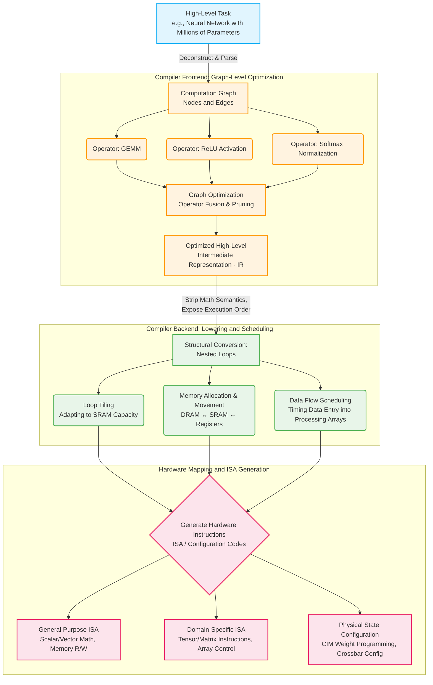

编译器将由“算子”组合而成的高层 Task 图结构，转化、降维并调度成了由底层硬件“ISA 指令”构成的执行程序

|层次|例子|描述|
|---|---|---|
|Graph|ResNet、Transformer 计算图|描述算子之间的数据流与依赖关系|
|Operator|Conv2D、MatMul、ReLU|模型中的功能级计算操作|
|Kernel|conv_kernel、gemm_kernel|Operator 在特定后端上的具体软件实现|
|ISA|load、store、vfmacc、matrix_mul、dma_start|定义机器可执行的指令及其语义|
|Microarchitecture|MAC/PE 阵列、Vector Unit、Register File、SRAM Buffer、DMA、Pipeline|定义 ISA/计算功能在硬件内部如何组织和执行|
|RTL|Verilog/SystemVerilog 中的 MAC array、DMA controller、SRAM interface|微架构的周期精确硬件实现|
|Circuit / Physical|乘法器、加法器、触发器、SRAM bitcell、标准单元、版图|具体晶体管/逻辑门级实现以及布局布线|

- 算子只定义了**数学功能**，不关心怎么实现
- Kernel 本质上是某个算子的具体执行实现（Implementation）
	- 根据平台、实现方式，一个算子可以有很多个 kernel

在将高层算子编译为底层指令之前，将会在逻辑和数学层面上减少计算量（算子融合）

