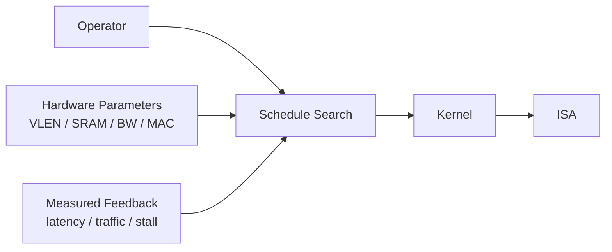

> [!abstract]
> 本文承接 [NPU的软硬件设计层次](/posts/20_Reserch/LLM%E6%8E%A8%E7%90%86/NPU%E7%9A%84%E8%BD%AF%E7%A1%AC%E4%BB%B6%E8%AE%BE%E8%AE%A1%E5%B1%82%E6%AC%A1/)，进一步解释 **Operator 和 Kernel 之间发生了什么**，以及硬件约束如何进入编译过程。

在 [NPU的软硬件设计层次](/posts/20_Reserch/LLM%E6%8E%A8%E7%90%86/NPU%E7%9A%84%E8%BD%AF%E7%A1%AC%E4%BB%B6%E8%AE%BE%E8%AE%A1%E5%B1%82%E6%AC%A1/) 中，NPU 的软硬件层次被概括为：

```text
Graph → Operator → Kernel → ISA → Microarchitecture → RTL
```

但这个描述容易产生一个误解：

> [!important]
> **Operator 并不是直接翻译成 ISA 指令的。**

真正连接算法与硬件的，是中间的 **Schedule 和 Kernel**。

一个更完整的过程是：

```text
PyTorch Model
    ↓
Graph / Graph IR
    ↓
Operator
    ↓
Loop / Tensor Program
    ↓
Schedule
    ↓
Kernel
    ↓
ISA
    ↓
Microarchitecture
```

- **Operator：算什么（What）**
- **Schedule：怎么在目标硬件上算（How）**
- **Kernel：这种计算方式的具体程序实现**
- **ISA：如何告诉硬件执行**
- **Microarchitecture：硬件内部实际上如何完成这些指令**

## 1. 一个 LLM Linear 的例子

例如 Transformer 中：

```python
q = self.q_proj(x)
```

在模型层面，它是一个 `Linear` Operator。

假设 Decode 阶段：

```text
X  : [1, K]
Wq : [K, N]
```

那么这个 Linear 实际上可以看成一个 GEMV：

$$
y[n] = \sum_k x[k] 	imes W[n][k]
$$

但 GEMV 仍然只是描述“算什么”。真正映射到硬件之前，还需要决定：

- 一次计算多少个 $n$？
- $K$ 维如何分块？
- 数据放 SRAM 还是 Register？
- 是否使用 Vector Unit？
- 权重如何读取？
- 中间结果如何复用？

这些决策就是 **Schedule**。

例如：

```text
GEMV
  ↓
N tile = 32
K tile = 64
vectorize N
cache input
keep accumulator in register
  ↓
RVV GEMV Kernel
```

Kernel 最终才进一步生成类似下面的 ISA 指令：

```asm
vsetvl
vle...
vfmacc...
vfred...
vse...
```

最后，由 Vector Unit、LSU、Register File、SRAM 等微架构模块真正执行这些指令。

因此完整关系是：

```text
Linear
  ↓
GEMV
  ↓
Loop
  ↓
tiling / vectorization / cache
  ↓
RVV Kernel
  ↓
load / FMA / reduction
  ↓
Vector Unit + LSU + Register File
```

## 2. Schedule 是软硬件连接的关键

这里最值得注意的是：

```text
Operator
   ↓
Schedule
   ↓
Kernel
   ↓
ISA
```

Operator 本身并不知道硬件有多少 MAC、Vector Length 多大、SRAM 有多少。而 Schedule 会根据这些硬件约束决定：

- tile size
- vector width
- data layout
- memory placement
- fusion
- parallelism

因此，所谓 **Architecture-aware Compiler**，本质上就是让编译器知道目标硬件的特征，并利用这些信息选择更合适的 Schedule 和 Kernel：


> [!info] 图中信息流
> 主链路从 Operator 经 Schedule、Kernel 和 ISA 到达 NPU Hardware；VLEN、SRAM、带宽和 MAC 数量约束 Schedule，而延迟、内存流量和 Stall 又形成反馈闭环。



这也形成了真正的软件—硬件闭环。

## 3. 总结

> [!summary]
> **PyTorch 描述模型，Operator 描述数学计算，Schedule 决定如何适配硬件，Kernel 实现这种计算方式，ISA 向硬件发出命令，而 Microarchitecture 决定这些命令最终如何被高效执行。**

因此，理解 NPU 不应该只建立：

```text
算子 → 指令集
```

的连接，更重要的是理解：

```text
Operator → Schedule → Kernel → ISA → Hardware
```

这条链路。

## 4. 关联阅读

- [NPU的软硬件设计层次](/posts/20_Reserch/LLM%E6%8E%A8%E7%90%86/NPU%E7%9A%84%E8%BD%AF%E7%A1%AC%E4%BB%B6%E8%AE%BE%E8%AE%A1%E5%B1%82%E6%AC%A1/)：定义从 Graph 到 Circuit / Physical 的完整层次。
- [NPU 的软硬件设计层次（原文）](https://tariya321.github.io/posts/20_reserch/llm%E6%8E%A8%E7%90%86/npu%E7%9A%84%E8%BD%AF%E7%A1%AC%E4%BB%B6%E8%AE%BE%E8%AE%A1%E5%B1%82%E6%AC%A1/)