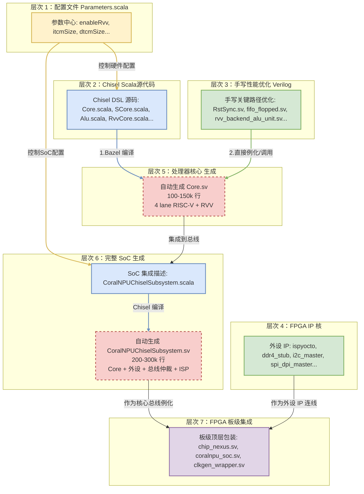
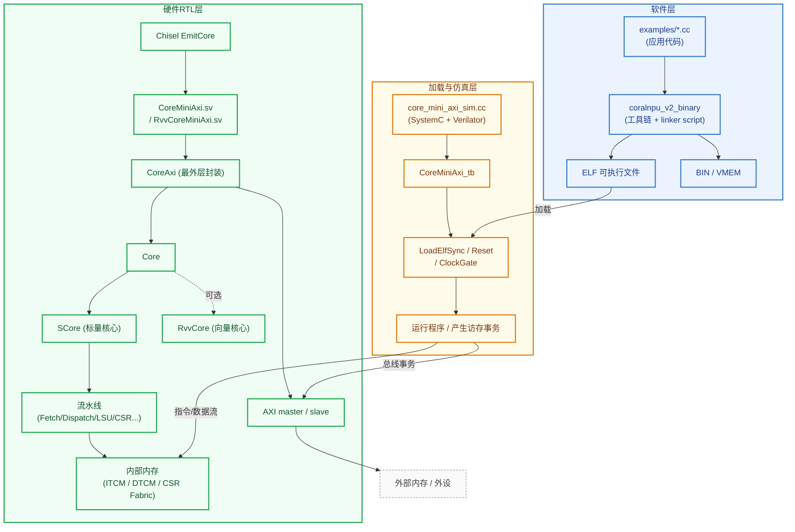
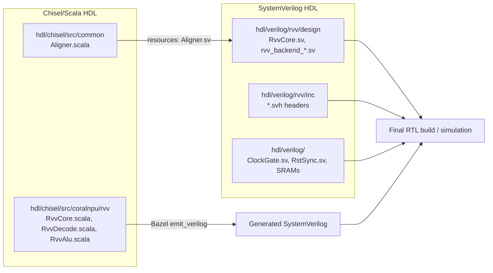

# coralnpu

- coral-npu，google研究团队开源的软硬件方案
- CoralNPU Nexus FPGA emulation boards (e.g., Board 09, Board 10)
- 运行于edge端，例如手机、手表等电子设备中


https://github.com/google-coral/coralnpu


## 1. 项目组件


标量核、向量执行单元、矩阵运算单元
- 标量核：负责程序控制流、分支判断和系统级调度的通用处理核心。
- 向量执行单元：通过 SIMD 方式对多数据元素进行并行处理的计算单元。
- 矩阵运算单元：基于 MAC 阵列对矩阵/张量乘加运算进行高并行加速的专用计算单元。




soc 描述组件

仔细看 sv 的代码，其实就是把核心子系统和一堆外设连接起来了

hdl 目录中分为 chisel 和 verilog 下的硬件代码，chisel 代码是核心
verilog 下的硬件代码的作用


综上，一个基本硬件和代码对应的结构图为：


**三个核心处理单元：**

| 单元 | 文件 | 功能 |
|------|------|------|
| **Scalar Core** | `scalar/SCore.scala` | 控制流 + 基本 ALU |
| **Vector Core** | `rvv/RvvCore.scala` | 向量/SIMD 操作 (256 位) |
| **Matrix Unit** | `scalar/Mlu.scala` | 乘法累加 (256 MACs/cycle) |


关于用到的总线


### 1.1. compiler 路径


提供了两种将模型部署到 npu 上的方法
- MLIR/IREE
	- 适合精细化定制
- LiteRT (原 TFLite)
	- 比较死板的格式转换器
	- 首先得把模型转成 TensorFlow 格式
	- 硬件算子需要匹配，否则回退到 cpu 计算


MLIR/IREE 的路径示意图



LiteRT 的路径



### 1.2. hardware design hierarchy demenstration

https://deepwiki.com/google-coral/coralnpu/7-fpga-implementation





### 1.3. sw2hw co-work design flow


### 1.4. rvv 设计结构




### 1.5. MAC 阵列

- 外积 MAC 使用 8bit×8bit → 32bit 累加，256 MAC/周期
- zvt 矩阵计算单元，含有 PE 和 systolic array


## 2. 运行实例

### 2.1. quick start


- bazel 7.4.1
>  please upgrade to 8.6.0

```bash
# Ensure that test suite passes
bazel run //tests/cocotb:core_mini_axi_sim_cocotb

# Build a binary
bazel build //examples:coralnpu_v2_hello_world_add_floats

# Build the Simulator (non-RVV for shorter build time):
bazel build //tests/verilator_sim:core_mini_axi_sim

# Run the binary on the simulator:
bazel-bin/tests/verilator_sim/core_mini_axi_sim --binary bazel-out/k8-fastbuild-ST-dd8dc713f32d/bin/examples/coralnpu_v2_hello_world_add_floats.elf
```

test: 构建并运行一个 **cocotb + Verilator 的 RTL 仿真测试**
把 `CoreMiniAxi` 这个硬件顶层编译成一个可执行的 verilator仿真模型，然后使用 python cocotb 作为驱动
run result



### 2.2. run mobileNet

- 由`BUILD`文件控制行为、工具链
	- 将TFLite 模型调用工具进行编译，产生mobilenet的binary data
- 脚本 **`run_full_mobilenet_v1.cc`** 编译产生 `.elf` 文件，在 coralNPU simulator 上作为可执行程序
	- 该脚本 link 了 生成的 model binary数据文件 `mobilenet_v1_025_224_int8_dummy.h`
- 脚本 **`npusim_run_mobilenet.py`** 作为 simulator 的控制器，会加载 elf 文件，作为中介传入 simulator

> [!cite] What is ELF file?
ELF (Executable and Linkable Format)，一种封装机器码的格式


一键运行指令
```
bazel run tests/npusim_examples:npusim_run_mobilenet
```
BUILD 文件解析


运行结果


这里值得注意的是显示 "fallback kernel"，表示没有 offload 到 npu
这是因为走到的 **Conv2D 算子形状没有命中这个优化内核支持的条件，所以代码主动退回到了 reference kernel**。
而 `conv.cc` 针对优化的是 4x4 (height x width)的卷积核，


将 python 中的 `output_data` 个数修改为更大的例如 20，100，将可以看到其他 case



refs:
- 如何使用pytorch
PyTorch和TensorFlow之对比


